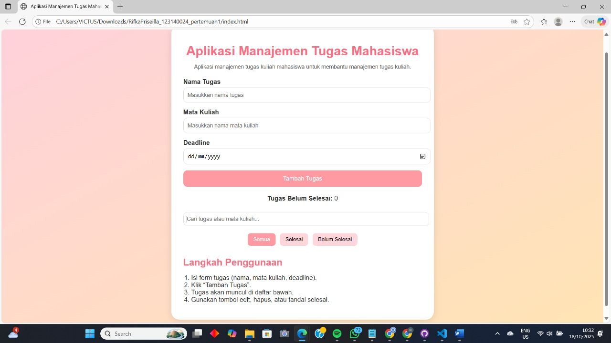
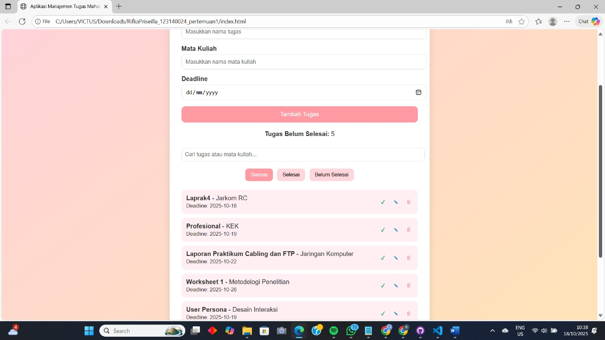
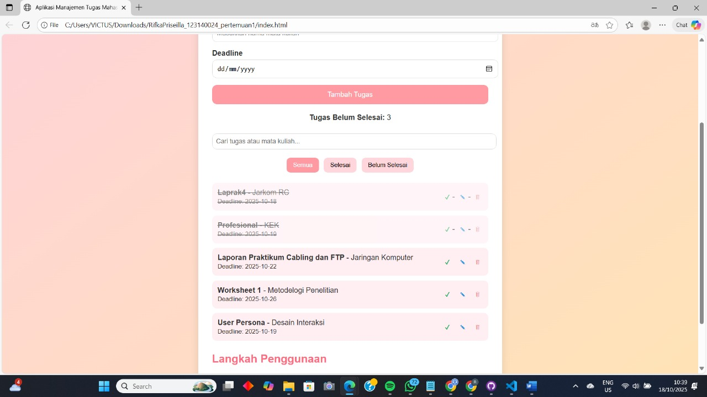

## Aplikasi Manajemen Tugas Mahasiswa
Nama : Rifka Priseilla  
NIM : 123140024  
Mata Kuliah : Pemrograman Web  
Pertemuan :1  

## Deskripsi Aplikasi  
Aplikasi ini dibuat untuk membantu mahasiswa dalam mengelola dan mengingat waktu untuk mengerjakan tugas.  
Dengan aplikasi ini, pengguna dapat menambah, mengedit, menandai selesai, dan menghapus tugas kuliah secara mudah. Seluruh data tugas disimpan menggunakan “localStorage” sehingga tetap tersimpan walaupun halaman direfresh.  

##  Fitur Utama  
1.	Menambahkan tugas baru dengan informasi: Nama tugas, Mata kuliah, Deadline  
2.	Menandai tugas sebagai “selesai/belum selesai”
3.	Menghapus tugas yang sudah tidak diperlukan  
4.	Mencari tugas berdasarkan “nama atau mata kuliah”
5.	Memfilter tugas berdasarkan “status (semua, selesai, belum selesai)”
6.	Menampilkan jumlah tugas yang belum selesai  
7.	Validasi input form (nama tugas & mata kuliah tidak boleh kosong, deadline harus diisi dengan benar)  

##  Penyimpanan Data (localStorage)
Data tugas disimpan secara lokal menggunakan “Web Storage API”: ```javascript
localStorage.setItem('tasks', JSON.stringify(tasks));  // Menyimpan data
JSON.parse(localStorage.getItem('tasks'));             // Mengambil data

## Tampilan Aplikasi
## Tampilan Awal


## Tambah Tugas


## Daftar Tugas

